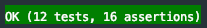

Wayfarer
=

#### Warning!
**The application is not intended for external use.**  
**The code it contains has a demonstration purpose.**

## Installation

* Clone this repository
* Create database: `/database/database.sqlite`
* Running configure database access in `.env` file (DB_CONNECTION=sqlite, see: env.example)
* Run `composer install`
* Run `composer dump-autoload`
* Run `php artisan key:generate`
* Run `npm install && npm run dev` to compile your fresh scaffolding.
* If webpack has problem resolving any packages, try to run `npm install` once again.
* Run `php artisan migrate`
* Run `php artisan db:seed`
* Run `php artisan serve`

## Administration Panel
	
- E-Mail Address: `admin@example.com`
- Password: `admin`

## Documentation Generator

For each development stage of the application, you can automatically generate  
the current content of the entire or selected fragment of API Documentation([see example](doc/markdown/repository/sami/wayfarerApiDocumentationExample.md)).  
- Run `php artisan generate:doc` and follow the instructions.


## Testing 

Located: `app/tests/Unit/Http/Api` and `app/tests/Unit/Repository/AdminSystem`

To test smoothly , follow these steps:

* Create database: /database/testing.sqlite
* Run php artisan migrate —database sqlite_testing
* 

## Description

####The app contains the following examples:
***
>**Library** - menu generator for administration panel.  
>  Located: `app/Repository/AdminSystem`

The basic class of library is `Manager.php`  
an instance of this class accepts two parameters: the `menu` and `filters`:   
- `menu` parameter is located in `resources/views/admin/menu/admin-menu.php`.  
  `menu` can be located anywhere else (e.g. in the configuration file),  
  in this case for reasons of consistency it is placed in views because it is associated with this layer. 
-  `filters` is the second parameter that properly filter such parameters as: url, css classes, active link, etc.

The generator must be registered in the central application configuration location,  
see: [app/Providers/AdminSystemServiceProvider](app/Providers/AdminSystemServiceProvider.php)  

Library structure and dependency between classes see [here](doc/markdown/repository/adminSystem/adminSystem.md)  
***
>**Api** (Swagger - along with token generation)  
>Located: `app/Http/Api`

Using the API service requires authorization, for this you should first generate the token see [here](doc/markdown/userManual/userManual.md)  
 
[Swagger](https://swagger.io/docs/specification/about/) is a set of open-source tools built around the OpenAPI Specification that:  
design, build, document and consume REST APIs.
***
>**Administrative panel**  
>   * an extensive template system,  
>   * automatic menu generation,  
>   * the possibility of using the SPA technique,  
>   * "all in one file" techniques (HTML, CSS, JS in index.blade.php)

The "Views" layer structure is divided into the following parts (see [here](doc/markdown/views/views.md) ):
* layouts/app - the main template which all others inherit from
* websites - pages for guests (see [here](doc/markdown/views/websites/websites.md))
* admin - pages for logged in users
* auth - login or registration system (see [here](doc/markdown/views/auth/auth.md) )
* vendor - templates from external websites

It is very easy to add any number of pages in the administrative panel,  
also you can easily create a main menu, sub-menu (sub-sub-meny, e.t.c)  
in the top, right and left bar (see [here](doc/markdown/views/admin/admin.md)).
***
>Adding any *language* without interfering with the code.

The sample application contains five languages:  
`German`, `English`, `French`, `Italian`, `Polish`.    
To add a different language, just add a new folder with the appropriate name in `app/resources/lang`,  
put the appropriate translations in it, then expand the `languages` array  
in the [app/config/settings.php](config/settings.php) configuration file to include the language.   
Any number of languages will be added automatically to the application.  
You can set the language order as you like.  

Example
````
    app/resources/lang/ar
        …Arabic translations

    app/config/settings.php
        ...
        'languages' => ['de', 'en', 'fr', 'it', 'pl’, 'ar’],
        or
        'languages' => ['ar', 'de', 'en', 'fr', 'it', 'pl’],
````

