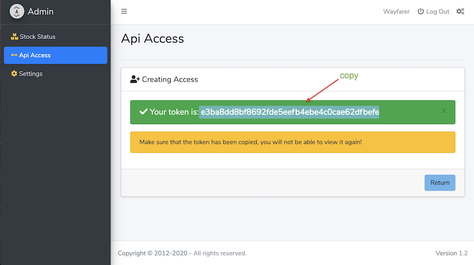
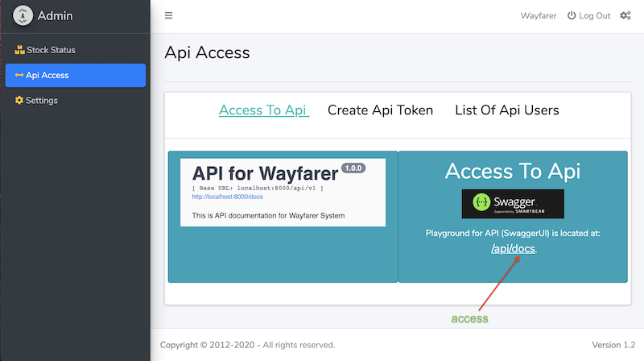
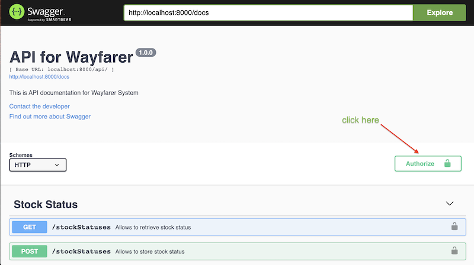
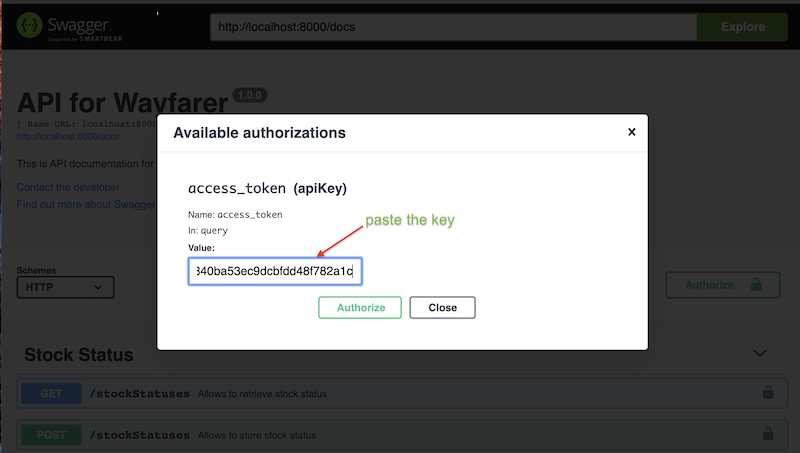

User Manual
-
### To use the Api interface, please follow the steps shown in the pictures below:  

***
##### first step  
  
***
##### second step
  
***
##### third step
  
***
##### fourth step
  
***
##### fifth step
  
***
[Wayfarer](../../../README.md)
