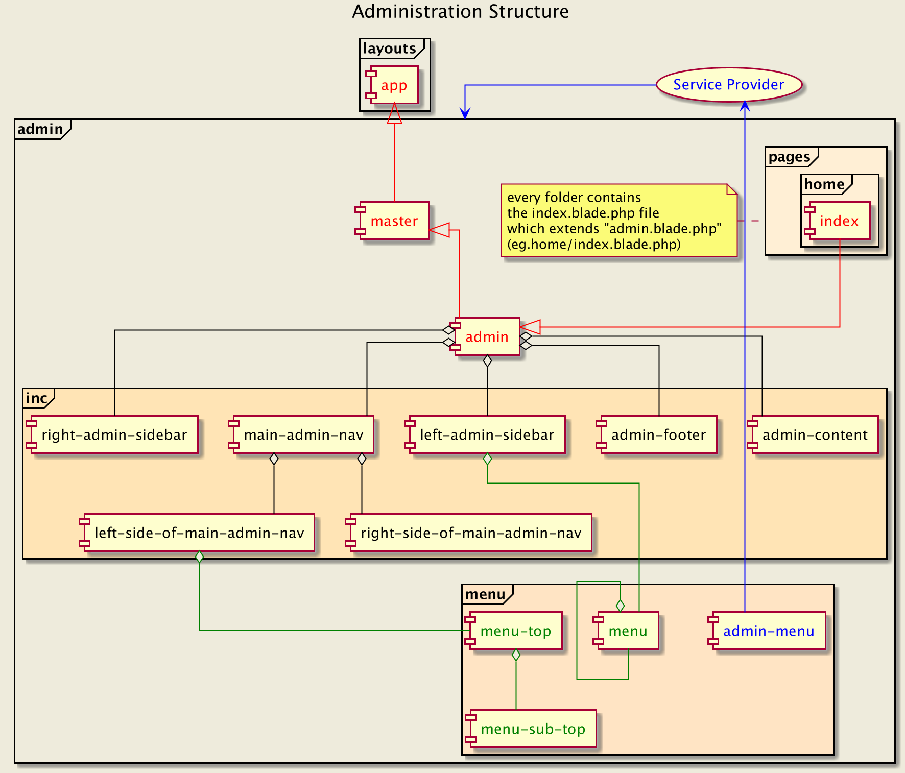

Admin
-



#### Technique of adding new pages on `admin` catalog 

1. We add new pages in the `pages/package_name/index.blade.php` 
	if necessary, we expand the package with necessary components 	
2. Each `index.blade.php` extends the `admin` component  
3. Page structure 
 
````
@extends('admin.admin')

@section('title', 'name_of_page'))

@section('admin-content-header')

    // here we add heading of page

@endsection

@section('admin-content')

    // here we add main content of page

@endsection

@section('x-template')

   // Vue.js - (here uses for demos)
   // this section is for define templates 
   // inside of a script element with the type 'text/x-template'

@endsection

@section('admin-admin-css')

    // here we our own styles

@endsection

@section('admin-admin-js')

    // here we our own scripts

@endsection
````
#### Automatic Navigation
* This system allows you to create any size menu while maintaining  
    the transparency of the code for the menu file.
* Navigation in the left and top bar ( using the `AdminSystem` library).

````
// menu components
    [
        'text' => 'bookmark_name,
        'icon' => 'icon_code',
        'icon_color' => 'icon_color',
        'route' => 'route_name',
    ],
    .....
    // submenu components
    [
        'text'    => 'bookmark_name',
        'icon'    => 'icon_code',
        'icon_color' => 'yellow',
        'topnav' => true, // this option is used if the navigation is to be in the top
        'submenu' => [
            [
                [
                    'text' => 'bookmark_name,
                    'icon' => 'icon_code',
                    'icon_color' => 'icon_color',
                    'route' => 'route_name',
                ],
                .....
            ],
        ],
    ],
````
***
[Wayfarer](../../../../README.md)  
