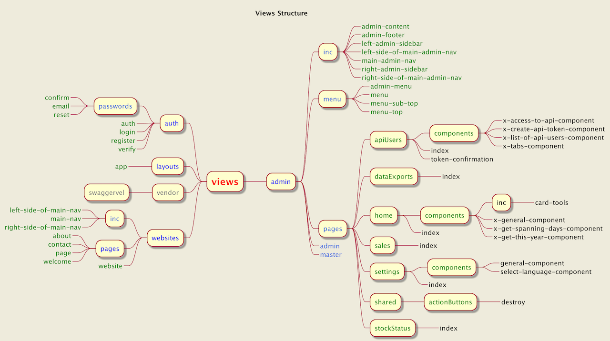

Views
-

#### The 'Views' layer structure is divided into the following parts

1. layouts/app - the main template which all others inherit from
2. websites - pages for guests
3. admin - pages for logged in users  
    3.1 auth - login or registration system
4. vendor - templates from external websites 

***

***

* [Admin](admin/admin.md)
* [Auth](auth/auth.md)
* [Websites](websites/websites.md)

***
[Table Of Content](../../tableOfContents.md)
