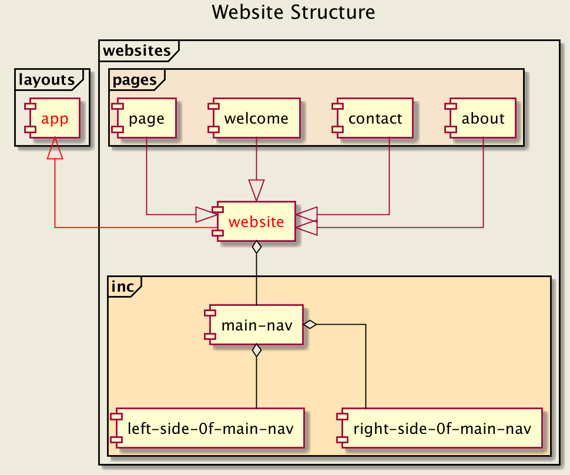

Website
-
***

***

#### Technique of adding new pages on websites catalog 

1. We add new pages in the `pages` catalog
2. Each new page extends the `website` component
3. Page structure

````
@extends('websites.website')

@section('title', 'name_of_page')

@section('web-body')

    // here we put the content of the page

@endsection

@section('web-css')

    // here we put our own styles

@endsection

@section('web-js')

    // here we put our own scripts

@endsection
````

***
[Wayfarer](../../../../README.md)
